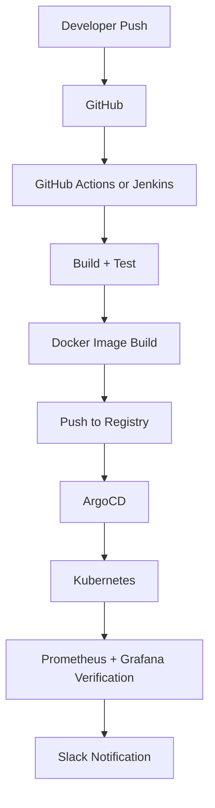

# Autonomous Release Orchestration Platform


A hands-on DevOps learning project that automatically takes application code from GitHub and safely deploys it to Kubernetes.

Replace YOUR_GITHUB_USERNAME in badge links after publishing the repository.

## Why this project exists

If many developers push code every day, manual deployment does not scale.
This project shows a safe, automated release flow that can be used by teams and also studied by beginners.

## How it works (simple)

1. You push code to GitHub.
2. CI (GitHub Actions or Jenkins) runs tests.
3. If tests pass, a Docker image is built.
4. The image is pushed to a container registry.
5. ArgoCD watches the repo and applies Kubernetes manifests.
6. Kubernetes rolls out the new version.
7. Prometheus and Grafana help verify release health.
8. Slack can notify the team about pipeline results.

## End-to-end flow



## Architecture image for public README

You can keep the Mermaid diagram above or export it as a PNG and add it like this:

```md

```

After you add docs/architecture.png, paste the line above directly into this README.

## What happens when you push to main

- CI starts automatically.
- The app is tested.
- A new image is built and pushed.
- ArgoCD syncs cluster state from Git.
- New pods start with health checks.
- If something is wrong, you can rollback quickly.

## Repository layout

- `.github/workflows`: CI pipelines (GitHub Actions)
- `jenkins`: CI pipeline alternative (Jenkinsfile)
- `app`: sample Node.js service with tests
- `docker`: Docker image definition
- `k8s`: Kubernetes manifests (base + overlays)
- `argocd`: ArgoCD Application definitions
- `monitoring`: Prometheus and Grafana starter config
- `scripts`: release verification and rollback helpers
- `docs`: setup and learning guides

## Quick start for readers

1. Install prerequisites: Docker, kubectl, kind or minikube, Node.js 20+, helm, argocd CLI.
2. Follow [docs/setup.md](docs/setup.md).
3. Choose one deployment guide:
   - [docs/deployment-linux.md](docs/deployment-linux.md)
   - [docs/deployment-windows.md](docs/deployment-windows.md)
   - [docs/deployment-dockerized.md](docs/deployment-dockerized.md)
4. Run local app tests:
   - cd app
   - npm ci
   - npm test
5. Build and run container:
   - docker build -f docker/Dockerfile -t local/autonomous-release:dev app
   - docker run -p 8080:8080 local/autonomous-release:dev
6. Apply Kubernetes base manifests:
   - kubectl apply -k k8s/overlays/dev
7. Install ArgoCD and apply the app specs from argocd/.

## 5-minute demo mode (dev namespace only)

Use this when you want a very fast first run.

1. Create local cluster and dev namespace:
   - kind create cluster --name aro-platform
   - kubectl create namespace dev
2. Deploy only dev overlay:
   - kubectl apply -k k8s/overlays/dev
3. Verify rollout:
   - kubectl get pods -n dev
4. Optional quick check:
   - sh scripts/verify-release.sh dev app=autonomous-release-app

For full flow with ArgoCD, monitoring, and rollback practice, use [docs/deployment-guide.md](docs/deployment-guide.md).

## Before making this repo public

1. Replace image references in Kubernetes manifests with your own registry path.
2. Update ArgoCD repoURL fields with your public GitHub repository URL.
3. Add a short project description and architecture image in this README.
4. Configure GitHub Secrets for Slack and registry authentication.
5. Never commit passwords, kubeconfig, or tokens.

## GHCR and Jenkins setup checklist

1. Create a GitHub personal access token with `write:packages` and `read:packages` scopes.
2. In Jenkins, add credential `ghcr-creds` (username: GitHub user/org owner, password: PAT).
3. Ensure Jenkins can read your repository remote URL (`origin`) so `GITHUB_ORG` can be auto-detected.
4. If auto-detection is not possible, set environment variable `GITHUB_ORG` in Jenkins job configuration.
5. Update Kubernetes image names to `ghcr.io/<your-org>/autonomous-release-platform:<tag>` for cluster pulls.

## Learning milestones

1. CI: push code, run tests, build image.
2. CD: update manifests and sync via ArgoCD.
3. Observability: verify deployment health using Prometheus and Grafana.
4. Safety: rollout checks, rollback strategy, and Slack notifications.

## Production readiness

Use [docs/production-readiness-checklist.md](docs/production-readiness-checklist.md) before real production rollout.

## Open source and community

- License: [LICENSE](LICENSE)
- Contributing guide: [CONTRIBUTING.md](CONTRIBUTING.md)
- Code of Conduct: [CODE_OF_CONDUCT.md](CODE_OF_CONDUCT.md)
- Security policy: [SECURITY.md](SECURITY.md)

## Required secrets and credentials

For GitHub Actions, configure repository secrets:

- REGISTRY_USERNAME
- REGISTRY_PASSWORD
- SLACK_WEBHOOK_URL

For Jenkins, configure:

- Credential ID `ghcr-creds` (GitHub username + PAT)
- Optional environment variable `GITHUB_ORG` (if not inferable from git remote)

For GitHub Container Registry (GHCR), you can use `GITHUB_TOKEN` with `packages: write` permission in GitHub Actions.
