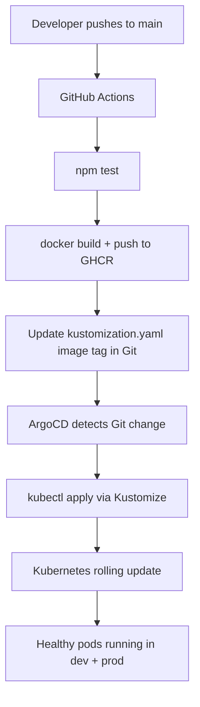

# Autonomous Release Orchestration Platform


A hands-on DevOps learning project that automatically takes application code from GitHub and safely deploys it to Kubernetes using GitHub Actions and ArgoCD.

---

## How it works

1. You push code to `main` on GitHub.
2. GitHub Actions runs tests, builds a Docker image, and pushes it to GHCR.
3. GitHub Actions updates the Kubernetes manifest with the new image tag and commits it back to Git.
4. ArgoCD detects the manifest change and syncs the cluster automatically.
5. Kubernetes performs a zero-downtime rolling update.

No manual `kubectl apply`. No SSH into servers. Git is the only source of truth.

For a detailed explanation of every step, see [docs/how-it-works.md](docs/how-it-works.md).

---

## End-to-end flow



---

## Repository layout

```
.github/workflows/    GitHub Actions CI pipeline
app/                  Node.js application and tests
docker/               Dockerfile
k8s/
  base/               Shared Kubernetes manifests
  overlays/dev/       Dev environment (1 replica, dev namespace)
  overlays/prod/      Prod environment (3 replicas, prod namespace)
argocd/               ArgoCD Application definitions
monitoring/           Prometheus and Grafana starter config
scripts/              Rollback and release verification helpers
docs/                 Guides and documentation
```

---

## Quick start

Requirements: Docker, kubectl, kind, Git running in WSL or Linux.

```bash
# 1. clone the repo
git clone https://github.com/code-and-secure/Autonomous-Release-Orchestration-Platform.git
cd Autonomous-Release-Orchestration-Platform

# 2. create the cluster
kind create cluster --name argo-platform

# 3. install ArgoCD
kubectl create namespace argocd
kubectl apply -n argocd -f https://raw.githubusercontent.com/argoproj/argo-cd/stable/manifests/install.yaml
kubectl wait --for=condition=available deployment/argocd-server -n argocd --timeout=180s

# 4. register the apps
kubectl apply -f argocd/application-dev.yaml
kubectl apply -f argocd/application-prod.yaml

# 5. create image pull secret (replace values with your GitHub username and PAT)
kubectl create secret docker-registry ghcr-pull-secret \
  --docker-server=ghcr.io \
  --docker-username=<github-username> \
  --docker-password=<github-PAT-with-read:packages> \
  -n dev

kubectl create secret docker-registry ghcr-pull-secret \
  --docker-server=ghcr.io \
  --docker-username=<github-username> \
  --docker-password=<github-PAT-with-read:packages> \
  -n prod

# 6. open the ArgoCD UI
kubectl port-forward svc/argocd-server -n argocd 8080:443
```

Open `https://localhost:8080` — username `admin`, password from:

```bash
kubectl get secret argocd-initial-admin-secret -n argocd \
  -o jsonpath="{.data.password}" | base64 -d && echo
```

For the full step-by-step guide with troubleshooting, see [docs/deployment-guide-wsl.md](docs/deployment-guide-wsl.md).

---

## GitHub Actions setup

The CI pipeline uses `GITHUB_TOKEN` — no extra secrets needed for building and pushing images.

One-time setup for GHCR package permissions:

1. Push any commit to `main` to create the package
2. Go to GitHub → Packages → `autonomous-release-platform` → Package settings
3. Under **Manage Actions access** → Add your repository with **Write** role

---

## Environments

| Environment | Namespace | Replicas | Overlay |
|---|---|---|---|
| dev | `dev` | 1 | `k8s/overlays/dev` |
| prod | `prod` | 3 | `k8s/overlays/prod` |

---

## Documentation

| File | Description |
|---|---|
| [docs/how-it-works.md](docs/how-it-works.md) | What happens on every deployment, end to end |
| [docs/deployment-guide-wsl.md](docs/deployment-guide-wsl.md) | Full setup guide for WSL and Linux with every command |
| [docs/learning-path.md](docs/learning-path.md) | Suggested learning stages for this project |
| [docs/production-readiness-checklist.md](docs/production-readiness-checklist.md) | Checklist before a real production rollout |

---

## Learning milestones

1. **CI** — push code, run tests, build and push image automatically
2. **CD** — update Git manifests, ArgoCD syncs the cluster
3. **Observability** — verify deployment health with Prometheus and Grafana
4. **Safety** — rollback strategy using ArgoCD history

---

## Open source

- License: [LICENSE](LICENSE)
- Contributing: [CONTRIBUTING.md](CONTRIBUTING.md)
- Code of Conduct: [CODE_OF_CONDUCT.md](CODE_OF_CONDUCT.md)
- Security policy: [SECURITY.md](SECURITY.md)
